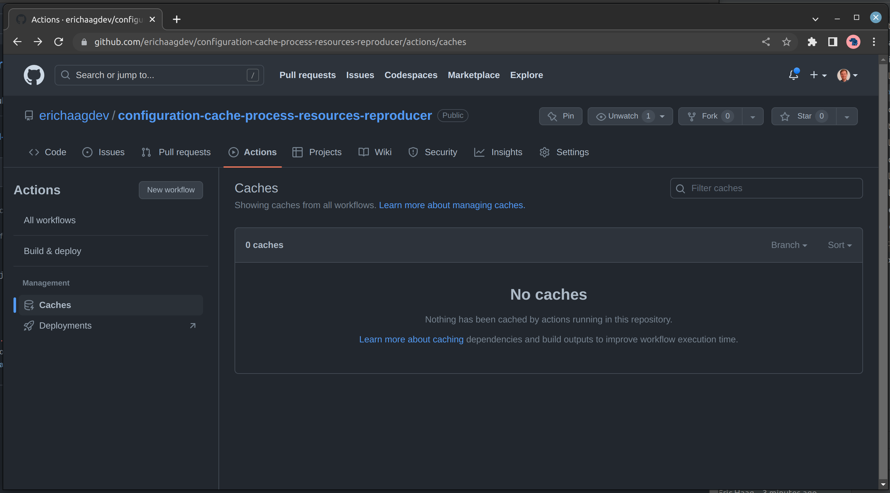
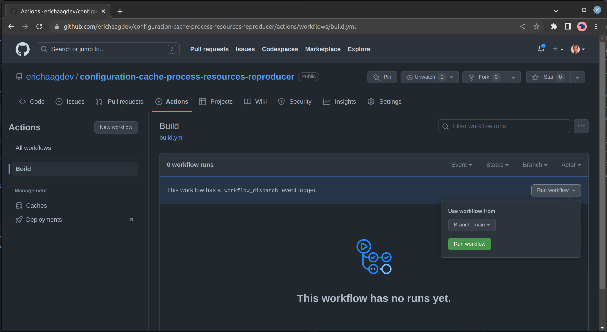
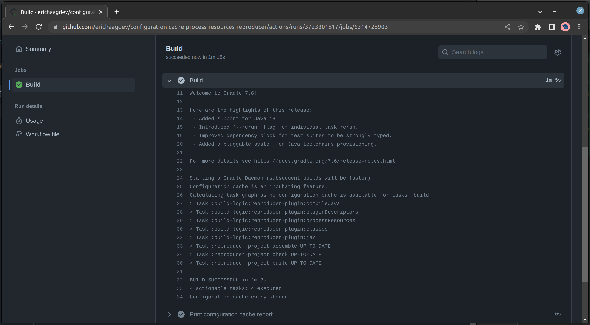
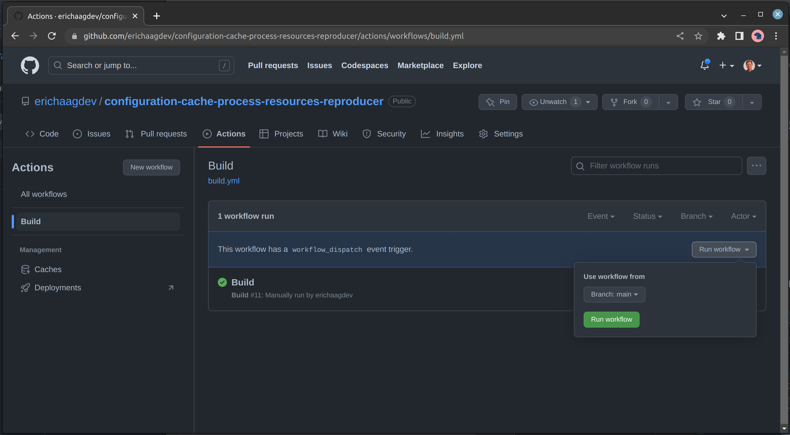
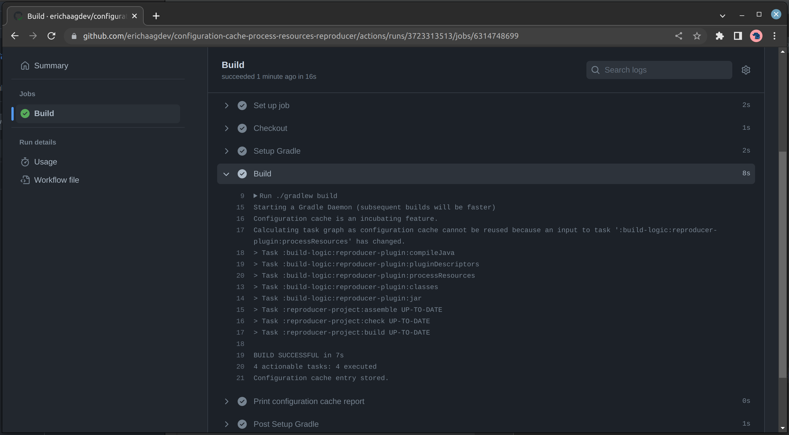

# Configuration Cache `processResources` reproducer

## Steps to reproduce

1. Start with a clean GitHub actions cache

2. Run the `Build` workflow

3. First build completes successfully and stores configuration cache entry

4. Run the `Build` workflow again

5. Second build completes but configuration cache was not used due to [[link](https://github.com/erichaagdev/configuration-cache-process-resources-reproducer/actions/runs/3723313513/jobs/6314748699#step:4:18)]`Calculating task graph as configuration cache cannot be reused because an input to task ':build-logic:reproducer-plugin:processResources' has changed.`
